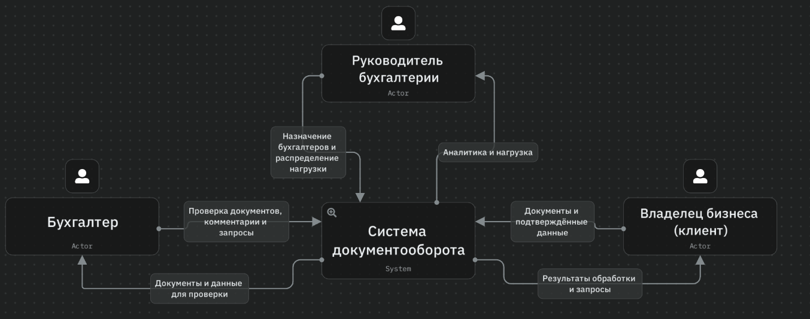
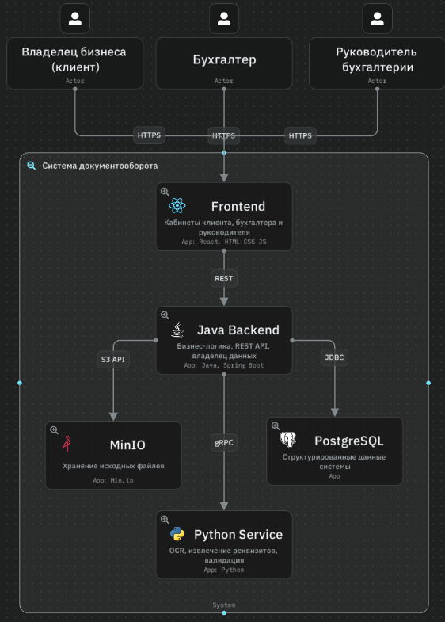
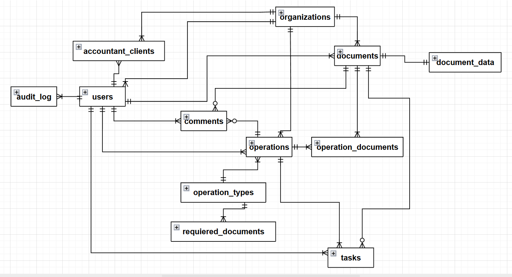
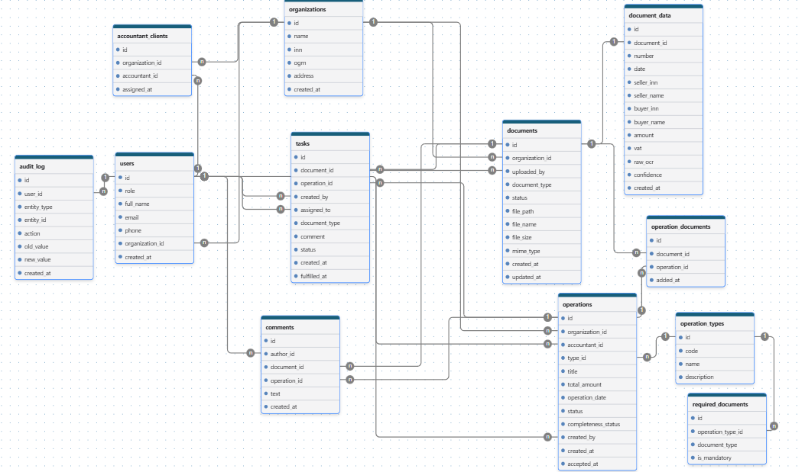

В рамках проектирования системы создадим схемы по методологии C4: контекстную диаграмму и диаграмму контейнеров.

Контекстная диаграмма отвечает за взаимодействие разрабатываемой системы с внешними сервисами и пользователями. На ней система представлена как «чёрный ящик», а акторами выступают владелец бизнеса (клиент), бухгалтер и руководитель бухгалтерии. Все связи подписаны протоколом HTTPS.

Диаграмма контейнеров отражает взаимодействие сервисов системы между собой. Внутри системы выделены пять контейнеров: Frontend, Java Backend, Python Service, PostgreSQL и MinIO. Java Backend является центральным компонентом, владеющим бизнес-логикой и данными: он принимает REST-запросы от Frontend, работает с PostgreSQL по JDBC, с MinIO по S3 API и вызывает Python Service по gRPC для обработки документов. Python Service не имеет доступа к базе данных и файловому хранилищу — его задача ограничивается OCR и извлечением реквизитов.

Для дальнейшей разработки базы данных добавим концептуальную модель данных. Она отражает основные сущности и связи между ними без указания атрибутов и типов данных — они будут определены на этапе логического и физического проектирования.

Логическая модель данных описывает структуру хранения информации: 12 сущностей и связи между ними. Ключевыми сущностями являются documents (отдельные бухгалтерские документы), document_data (данные, извлечённые OCR), operations (хозяйственные операции, объединяющие связанные документы), operation_documents (связь M:N между операциями и документами) и required_documents (правила комплектности для каждого типа операции). Типы полей указаны условно; физическая схема с конкретными типами СУБД и индексами будет уточнена на этапе реализации.

